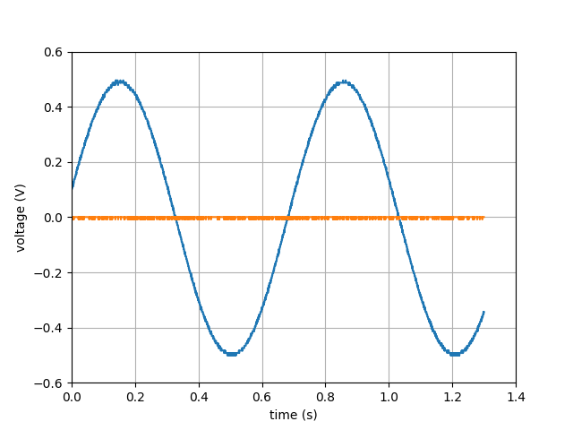

# scope-py
Simple python script to control PS2000 series Picoscope.
Works by wrapping the libps2000.so API (see PicoScope 2000 Series Programmer's Guide).
Tested on linux (nixos) with a 2204A Picscope.
Should work with trivial modifications on windows.



# Supported Features:
- control inbuilt signal generator
- setup channels
- aquiring data in block mode

# Prerequisites:
- libusb1
- python
- numpy
- matplotlib (only for example)

# Setup Instructions:
- aquire libps2000.so
- edit the line 
>lib = cdll.LoadLibrary("/home/jd/scope-py/libps2000.so")

in scope.py to point to libps2000.so
- allow filesystem to access scope
- run example.py to check if it is working

# Special Nixos instructions:
> nix-shell

> source setup.sh

Will load a nix-shell with libusb1, python and the required libraries

# How to aquire libps2000.so
- go [here](https://labs.picotech.com/picoscope7/debian/pool/main/libp/libps2000/)
- download the right version (amd64 usually)
- extract the file using ```ar``` and ```tar```
- libps2000.so is contained in the unpacked files (as libps2000.X.X.X.so with some version numbers)

# How to allow access to the scope
Brute force option (not recommended):
- Run scripts as root
Smart option (recommended):
- Make udev rule:  
> SUBSYSTEM=="usb", ATTR{idVendor}==SCOPEVENDORID, ATTR{idProduct}==SCOPEPRODUCTID, TAG+="uaccess", RUN{builtin}+="uaccess"
- You can get SCOPEVENDORID:SCOPEPRODUCTID from lsusb
- On nixos: add this line to your configuration.nix:
>services.udev.extraRules = ''SUBSYSTEM=="usb", ATTR{idVendor}==SCOPEVENDORID, ATTR{idProduct}==SCOPEPRODUCTID, TAG+="uaccess", RUN{builtin}+="uaccess"'';

